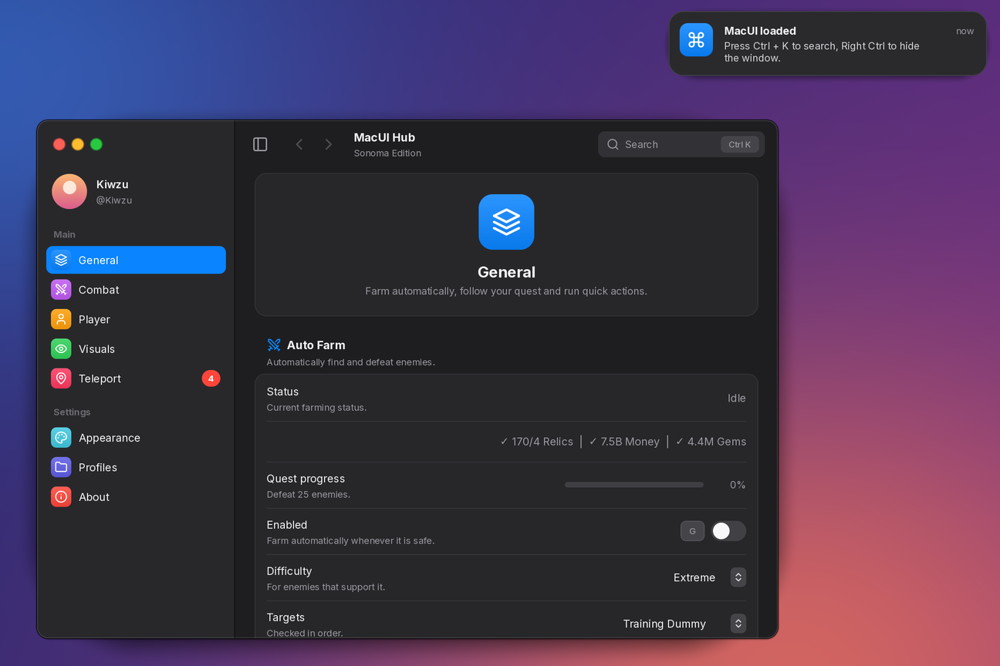
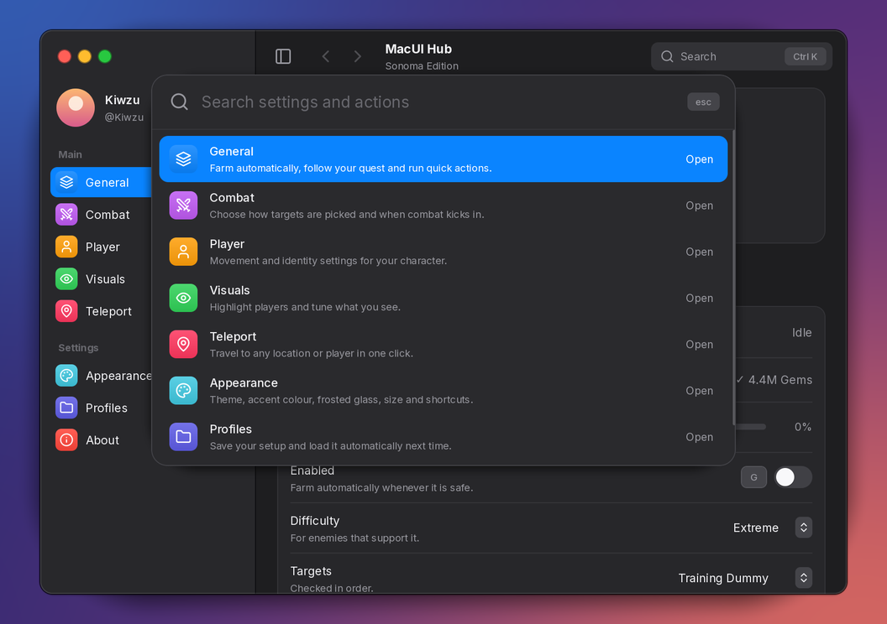
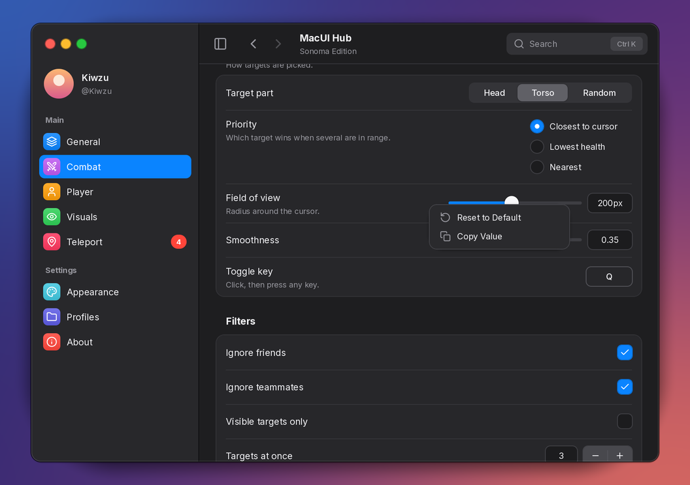
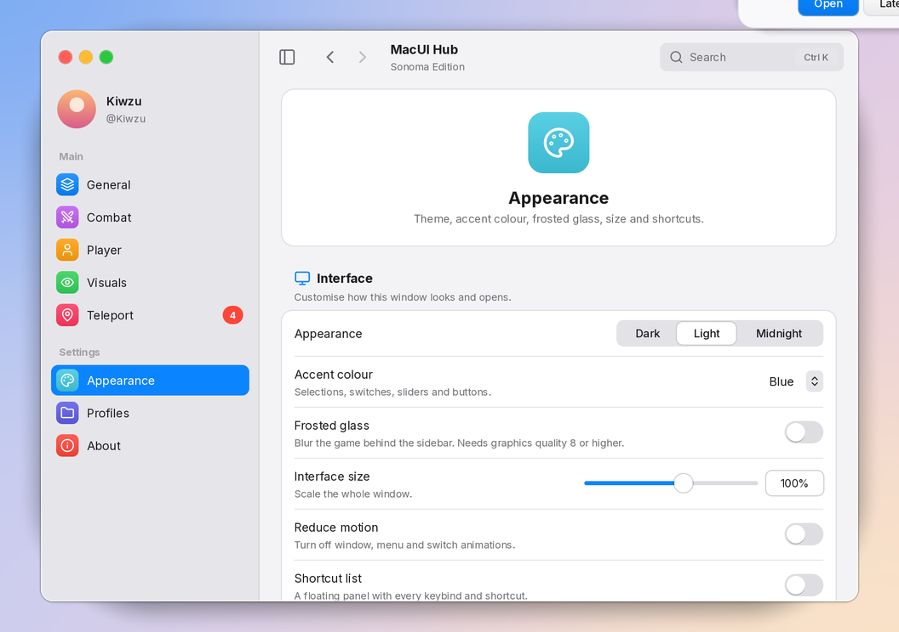
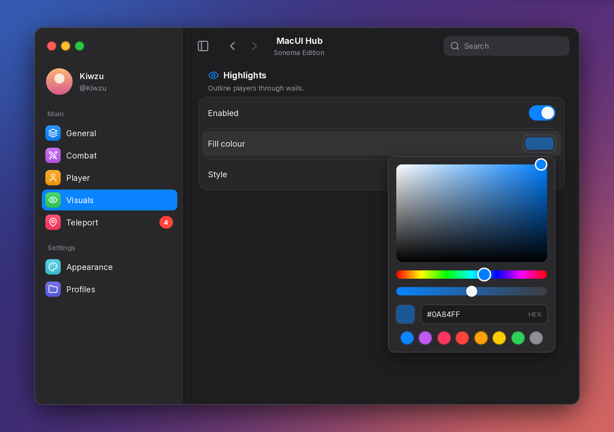
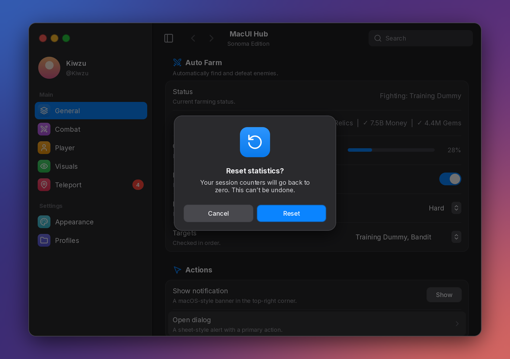
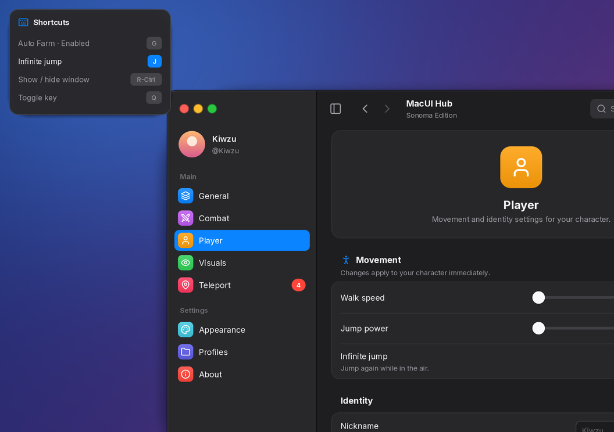
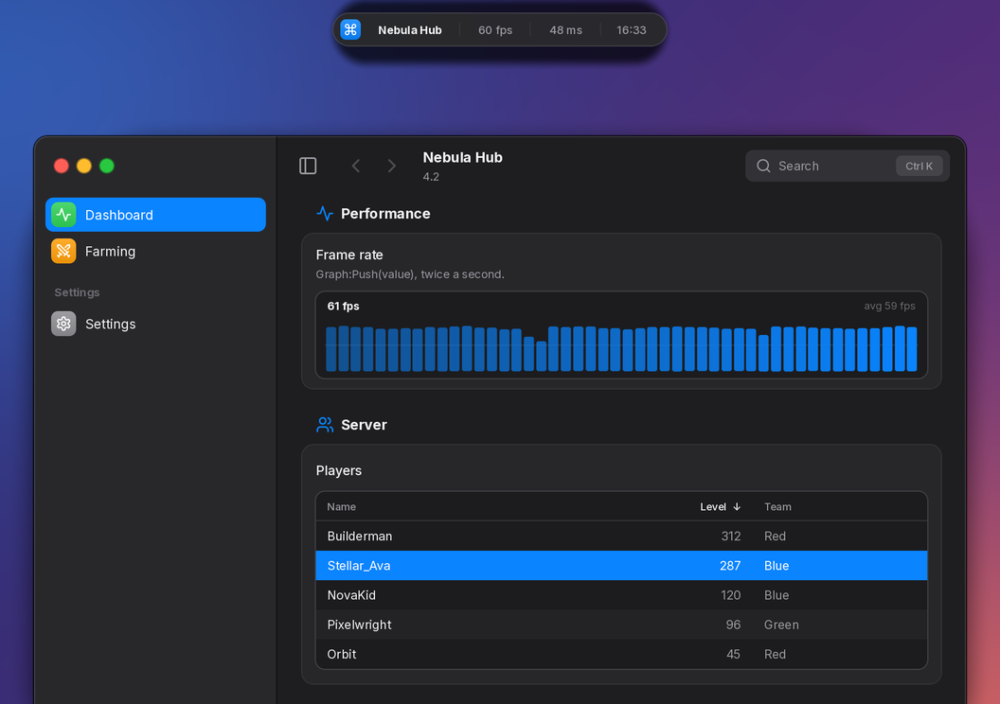
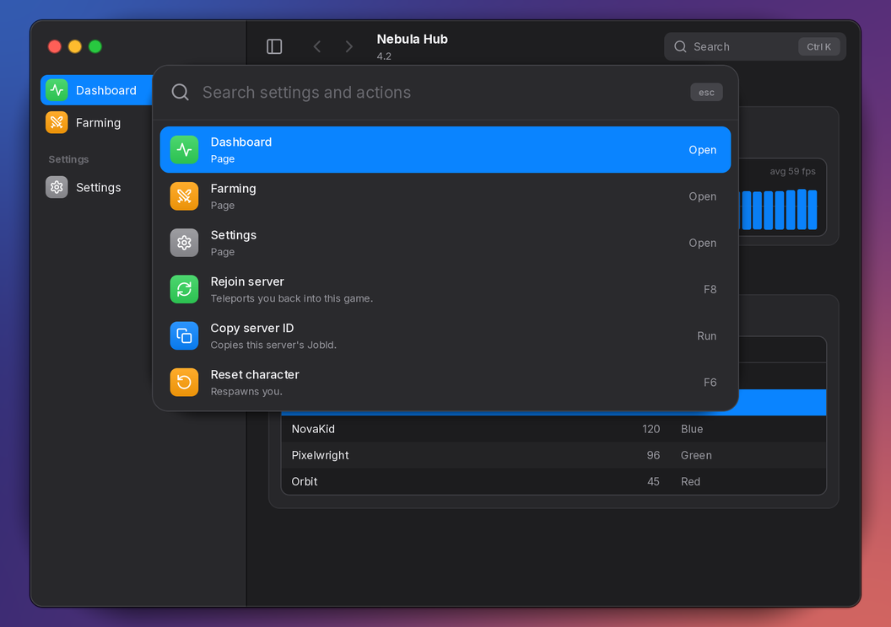
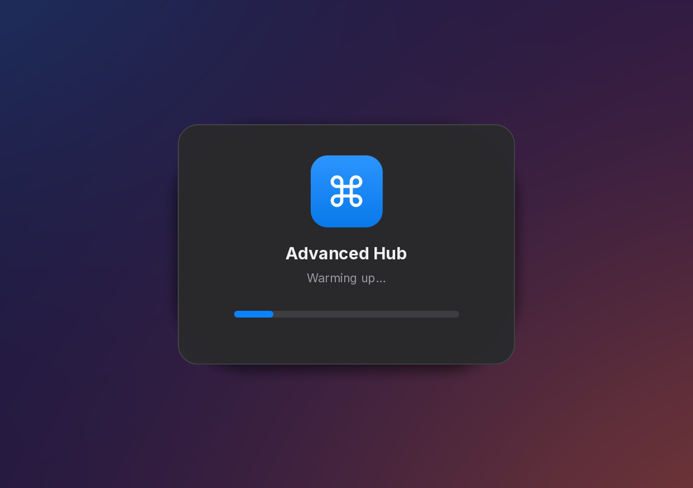

# 🍎 MacUI

**A macOS System Settings–style interface library for Roblox.**

Traffic lights, a frosted sidebar with colourful icon tiles, page headers, grouped inset rows, native-looking controls, Spotlight search and commands, undo, right-click menus, keyboard shortcuts, live graphs and tables, sheets and Notification Center banners. The API is compatible with [Fluent](https://github.com/dawid-scripts/Fluent), so existing scripts only need a new loadstring.



| Spotlight (Ctrl + K) | Right-click menu | Light |
| :---: | :---: | :---: |
|  |  |  |
| **Colour picker** | **Dialog with a text field** | **Shortcut list** |
|  |  |  |
| **Graph, table and watermark** | **Commands in Spotlight** | **Loading screen** |
|  |  |  |

> These previews were rendered outside Roblox. In game the text uses Builder Sans and the icons come from Roblox assets, so glyphs look slightly different.

---

## Features

**Looks like a Mac**
- Real window chrome: traffic lights with hover glyphs (close asks first, minimise goes to a dock icon, zoom maximises), a draggable toolbar (double-click to zoom), a resize grip, layered shadows and a hairline bezel.
- A sidebar with System Settings icon tiles (or tinted or plain icons), section headings, a sliding selection, badges, an avatar card and a collapse button. Turn on **frosted glass** and it blurs the game behind it.
- **Page headers**: give a tab a `Description` and it opens with a large icon, title and blurb, just like the panes in System Settings.
- Grouped rows with inset separators, and Dark, Light and Midnight themes with any accent colour. Every colour animates when you switch.

**Easy to use**
- **Spotlight** (Ctrl + K, or Cmd + K on Mac): fuzzy-search every setting and page. Enter flips a toggle or runs a button, Shift + Enter just shows it, and the arrow keys move the selection.
- **Right-click (or long-press) any row** to reset it to its default, copy its value, select or clear every option in a multi-select, or give it a **keyboard shortcut**.
- **Shortcuts**: bind a key to any toggle or button from code or from the menu. A small HUD confirms each press ("Auto Farm On"). A floating **shortcut list** shows every keybind and shortcut.
- **Undo and redo** (Ctrl/Cmd + Z, Ctrl/Cmd + Shift + Z): every change the user makes to a control can be taken back. A slider drag or a loaded profile undoes in one step.
- **Commands**: add actions ("Rejoin server", "Copy server ID") that live in Spotlight and can have their own key.
- **Collapsible sections** with a disclosure arrow, for pages with a lot of settings.
- **Tooltips**, **dependencies** (grey out or hide a row until another option is on), live toolbar **search** (Enter jumps to the first match) and back/forward history.
- **Remembers itself**: window position, size, page, theme, accent, scale and frosted glass come back next time (InterfaceManager). Profiles can **save automatically** (SaveManager).
- Re-running your script replaces the old window instead of stacking a second one.
- **Reduce motion**, automatic scaling on small screens, and touch support.

**Complete**
- Controls: switch, checkbox, slider with an editable value, **stepper**, **radio group**, pop-up menu (single, multi or searchable, plus live **player** and **team** lists), text field, shortcut recorder, colour well with an HSV/hex popover, segmented control, progress bar, key/value label, paragraph, **code block** with a copy button, **image**, and push buttons.
- **Live graph** (FPS, ping, earnings) and a sortable, selectable **table** (players, logs, stats).
- Notifications with **action buttons**, dialogs with an optional **text field**, and HUD toasts.
- A **loading screen** while your script builds, and a draggable **watermark** with FPS, ping and a clock.
- Addons: SaveManager (profiles, autoload, autosave, and **profile codes** to share settings; compatible with Fluent config files), InterfaceManager, ThemeManager (with a **theme editor** that saves your own themes) and AccentManager.

---

## Quick start

```lua
local MacUI = loadstring(game:HttpGet("https://raw.githubusercontent.com/Kiwzu/Mac-OS-UI-LUA/refs/heads/main/MacUIFramework.lua"))()

local Window = MacUI:CreateWindow({
    Title = "My Hub",
    SubTitle = "Sonoma Edition",
    Icon = "command",
    Size = UDim2.fromOffset(800, 560),
    Theme = "Dark",
    Accent = "Blue",
    MinimizeKey = Enum.KeyCode.RightControl,
})

local Main = Window:AddTab({
    Title = "General",
    Icon = "layers",
    Section = "Main",
    Description = "Farm automatically and run quick actions.", -- page header
})
local Farm = Main:AddSection({ Title = "Auto Farm", Description = "Automatically defeat enemies.", Icon = "swords" })

Farm:AddToggle("AutoFarm", {
    Title = "Enabled",
    Description = "Farm whenever it is safe.",
    Default = false,
    Shortcut = "G",                              -- press G anywhere to flip it
    Tooltip = "Pauses by itself while you're in a menu.",
    Callback = function(on) print("Auto farm:", on) end,
})

Farm:AddDropdown("Targets", {
    Title = "Targets",
    Values = { "Bandit", "Pirate", "Sea Beast" },
    Multi = true,
    DependsOn = "AutoFarm",                      -- greyed out until Auto Farm is on
})
```

`Example_Main.lua` is a finished-looking example hub. `Demo_FullHub.lua` is a tour of the whole API: every function, with each row naming the call it makes. Run it with:

```lua
loadstring(game:HttpGet("https://raw.githubusercontent.com/Kiwzu/Mac-OS-UI-LUA/refs/heads/main/Demo_FullHub.lua"))()
```

---

## Window

```lua
local Window = MacUI:CreateWindow({
    Title = "My Hub",               -- toolbar title
    SubTitle = "v1.0",              -- toolbar subtitle
    Icon = "command",               -- Lucide icon name or rbxassetid:// (dock, dialogs)
    IconColor = "Purple",           -- tile colour for that icon (defaults to accent)
    Size = UDim2.fromOffset(800, 560),
    MinSize = Vector2.new(560, 380),
    TabWidth = 214,                 -- sidebar width
    Theme = "Dark",                 -- "Dark" | "Light" | "Midnight" | your own
    Accent = "Blue",                -- accent name, hex string or Color3
    SidebarStyle = "Tile",          -- "Tile" | "Tinted" | "Plain"
    Profile = true,                 -- avatar card; or { Title = "", Subtitle = "", Image = "" }
    MinimizeKey = Enum.KeyCode.RightControl,
    Acrylic = false,                -- frosted-glass sidebar (needs graphics quality 8+)
    KeybindList = false,            -- show the floating shortcut list
    Search = true,                  -- toolbar search field
    Spotlight = true,               -- Ctrl/Cmd + K command palette
    SpotlightKey = Enum.KeyCode.K,
    Resizable = true,
    ConfirmClose = true,            -- ask before the red button unloads the UI
    ReplaceExisting = true,         -- re-running the script closes the old window
    Scale = nil,                    -- fixed UI scale; nil picks one to fit the screen
    Undo = true,                    -- Ctrl/Cmd + Z undoes the user's last change
    Loading = false,                -- true, or { Title, Subtitle, Icon, Duration = seconds | false }
    Watermark = false,              -- true, or the options of MacUI:SetWatermark
})
```

With `Loading`, the window stays hidden behind a loading card while your script adds its tabs, then opens by itself after `Duration` seconds (1.4 by default). With `Duration = false`, drive the bar yourself and open the window when you're ready:

```lua
local Window = MacUI:CreateWindow({ Title = "My Hub", Loading = { Subtitle = "Fetching data…", Duration = false } })
Window.Loader:SetProgress(0.5, "Loading items…")   -- 0 to 1, with a status line
Window:FinishLoading("Ready")
```

| Method | Description |
| --- | --- |
| `Window:AddTab({ Title, Icon, IconColor, Section, Badge, Description })` | Adds a sidebar tab. `Section` starts a new sidebar heading; `Description` adds a page header. |
| `Window:AddTabSection(title)` | Adds a sidebar heading such as "Settings". |
| `Window:SelectTab(indexOrTab)` | Switches tab. |
| `Window:GoBack()` / `Window:GoForward()` | Navigates the tab history. |
| `Window:OpenSpotlight()` / `Window:CloseSpotlight()` | Opens or closes the command palette. |
| `Window:Reveal(elementOrIdx)` | Switches to the element's tab, scrolls to it and flashes it. |
| `Window:Toast(text, { Detail, Icon, Highlight, Duration })` | Shows a short HUD at the bottom of the window. |
| `Window:Dialog({ Title, Content, Icon, Input, Buttons })` | Shows an alert sheet. The first button is the primary action. |
| `Window:Minimize()` / `Window:Restore()` / `Window:Toggle()` | Hides or shows the window, with a dock icon while hidden. |
| `Window:SetMaximized(bool)` | Zoom. |
| `Window:SetSidebarVisible(bool)` / `Window:ToggleSidebar()` | Collapses or expands the sidebar. |
| `Window:SetAcrylic(bool)` | Frosted glass on or off. Returns `false` if graphics quality is too low. |
| `Window:SetKeybindList(bool)` | Shows or hides the floating shortcut list. |
| `Window:GetState()` / `Window:ApplyState(state)` | Position, size, tab and sidebar, as a table you can save. `Window.StateChanged` fires when it changes. |
| `Window:SetTitle(text)` / `Window:SetSubtitle(text)` | Updates the toolbar text. |
| `Window:SetScale(number)` | Scales the whole window. |
| `Window:SetMinimizeKey(KeyCode or name)` | Changes the show/hide key. |
| `Window:Search(text)` | Runs the toolbar search programmatically. |
| `Window:AddCommand({ Title, Description, Icon, IconColor, Keywords, Shortcut, Callback })` | Adds an action to Spotlight (listed before you type, and found by title, description or keywords). `Shortcut` also runs it from the keyboard. Returns a command with `:Run()`, `:SetShortcut(key)` and `:Destroy()`. |
| `Window:FinishLoading(text)` | Opens a window created with `Loading`. `Window.Loader` is its loading card. |

Tabs have `Tab:SetBadge(number | text | nil)`, `Tab:SetTitle(text)` and `Tab:Select()`.

## Sections

```lua
local Section = Tab:AddSection({ Title = "Movement", Description = "Applies instantly.", Icon = "person-standing" })
-- or the Fluent form: Tab:AddSection("Movement")
```

Elements added to a section go into its rounded group. Elements added straight to a tab go into a group without a header.

```lua
local Advanced = Tab:AddSection({ Title = "Advanced", Collapsible = true, Collapsed = true })
Advanced:SetCollapsed(false)   -- click the title to fold it; search results and Window:Reveal open it
```

## Elements

Each element takes an optional index as its first argument, just like Fluent. Elements that have an index are stored in `MacUI.Options[index]` and are picked up by SaveManager.

```lua
-- Switch (Style = "Checkbox" or AddCheckbox for a checkbox)
local Toggle = Section:AddToggle("Idx", { Title = "Enabled", Description = "…", Default = false, Shortcut = "F", Callback = function(v) end })

-- Slider
Section:AddSlider("Speed", { Title = "Walk speed", Min = 16, Max = 120, Default = 16, Rounding = 0, Increment = 1, Suffix = "", Callback = function(v) end })

-- Stepper: a number field with − and + (hold to repeat)
Section:AddStepper("Radius", { Title = "Search radius", Min = 20, Max = 300, Step = 20, Default = 100, Suffix = " studs", Callback = function(v) end })

-- Radio group
Section:AddRadio("Priority", { Title = "Priority", Values = { "Closest", "Lowest health" }, Default = "Closest", Callback = function(v) end })

-- Pop-up menu (Multi = true for checkmarks; Searchable = true for a filter field)
Section:AddDropdown("Mode", { Title = "Difficulty", Values = { "Easy", "Hard" }, Default = "Easy", Multi = false, AllowNull = false, Callback = function(v) end })
-- Values = "Players" or "Teams" keeps the list in sync with the server (ExcludeLocal = false to include you)
Section:AddDropdown("Target", { Title = "Player", Values = "Players", Searchable = true })

-- Text field
Section:AddInput("Name", { Title = "Nickname", Placeholder = "…", Default = "", Numeric = false, Finished = true, MaxLength = 20, Width = 180, Callback = function(text) end })

-- Shortcut recorder (Mode: "Toggle" | "Hold" | "Always")
Section:AddKeybind("Key", { Title = "Toggle key", Default = "Q", Mode = "Toggle", Callback = function(active) end, ChangedCallback = function(key) end })

-- Colour well (Transparency adds an opacity slider)
Section:AddColorpicker("Color", { Title = "Fill", Default = Color3.fromRGB(10, 132, 255), Transparency = 0.5, Callback = function(color) end })

-- Segmented control
Section:AddSegmented("Part", { Title = "Target", Values = { "Head", "Torso" }, Default = "Head", Callback = function(v) end })

-- Buttons: a chevron row, or a push button when ButtonText is set (Style: "Primary" | "Destructive").
-- Give a button an index (or Flag) and its shortcut is saved with your profile.
Section:AddButton({ Title = "Rejoin", Description = "…", ButtonText = "Rejoin", Style = "Primary", Shortcut = "R", Callback = function() end })

-- Read-only rows
local Status = Section:AddLabel("Status", { Title = "Status", Description = "…", Value = "Idle" })  -- Status:SetValue("Fighting")
Section:AddParagraph({ Title = "About", Content = "Longer text, <b>rich text</b> supported." })
local Bar = Section:AddProgress("Quest", { Title = "Quest progress", Max = 25, Default = 0 })         -- Bar:SetValue(10)
Section:AddCode({ Title = "Loader", Code = 'loadstring(game:HttpGet("…"))()' })                     -- with a copy button
Section:AddImage({ Title = "Map", Image = "rbxassetid://…", Height = 150, ScaleType = "Crop" })

-- Live bar graph: shows the latest value and the average. Min/Max fix the scale (automatic otherwise).
local Fps = Section:AddGraph("Fps", { Title = "Frame rate", Points = 40, Min = 0, Suffix = " fps", Height = 76 })
Fps:Push(60)                                -- also :SetValues(list), :Clear(), :SetRange(min, max)

-- Table: click a header to sort, click a row to select it
local Players = Section:AddTable("Players", {
    Title = "Players",
    Columns = { "Name", { Title = "Level", Align = "Right", Width = 0.5 } },  -- Width: share of the row (default 1)
    Rows = { { "Builderman", 90 }, { Name = "Noob", Level = 3 } },   -- arrays, or tables keyed by column title
    MaxRows = 6, SortBy = "Level", Descending = true,
    Callback = function(row, index) end,
})
Players:AddRow({ "Guest", 1 })              -- also :SetRows(list), :RemoveRow(row or index), :Clear(),
                                            -- :SortBy(column, descending), :Select(row or index), :GetSelected()
```

### Options every element accepts

| Option | Description |
| --- | --- |
| `Tooltip` | Text (or a function returning text) shown after hovering the row. |
| `DependsOn` | An index (`"AutoFarm"`), `{ "Mode", "Hard" }` (equals a value, or contains it for multi-selects) or a function. The row is disabled until it is true. |
| `DependsMode` | `"Disable"` (default) or `"Hide"`. |
| `Keywords` | Extra words for search and Spotlight. |
| `Shortcut` | Toggles and buttons: a key name such as `"G"` or a `KeyCode`. |

### Element methods

Every element has `:SetTitle(text)`, `:SetDesc(text)`, `:SetVisible(bool)`, `:SetDisabled(bool)` (also `:Lock()` and `:Unlock()`), `:OnChanged(fn)` and `:Destroy()`. Value elements expose `.Value`, `:SetValue(...)`, `:Reset()`, `:IsDefault()` and `:GetText()`. Toggles and buttons have `:SetShortcut(key)` (`nil` removes it) and `:RecordShortcut()`. Dropdowns, segmented controls and radio groups also have `:SetValues(list)`, and dropdowns have `:Open()`.

`MacUI.OptionChanged` fires `(index, value, element)` whenever any indexed element changes.

### Undo

Changes the user makes to indexed toggles, sliders, menus, text fields, keybinds, colours, segmented controls, steppers and radio groups are recorded. Changes made in the same moment (a slider drag, a loaded profile, a toggle and its knock-on effects) undo as one step. Changes your script makes on its own aren't recorded.

```lua
MacUI:Undo()  MacUI:Redo()                  -- also Ctrl/Cmd + Z, Ctrl/Cmd + Shift + Z and Ctrl + Y
MacUI:CanUndo()  MacUI:CanRedo()  MacUI:ClearHistory()
MacUI:SetUndoEnabled(false)
```

## Notifications, toasts & dialogs

```lua
MacUI:Notify({
    Title = "Farm finished",
    SubContent = "Blessed Maiden",   -- optional bold second line
    Content = "Collected 7.5B money.",
    Icon = "bell", IconColor = "Green",
    Duration = 5,                    -- seconds; 0 or false keeps it until clicked
    Buttons = {                      -- optional actions (the first is primary)
        { Title = "Open", Callback = function() end },
        { Title = "Later" },
    },
})

Window:Toast("Teleported", { Detail = "Spawn", Icon = "map-pin" })

Window:Dialog({
    Title = "Rename profile",
    Content = "Choose a new name.",
    Icon = "pencil",
    Input = { Placeholder = "Name", Default = "Farming" },   -- optional text field
    Buttons = {
        { Title = "Rename", Callback = function(text) end },  -- primary (Enter also runs it)
        { Title = "Cancel" },
    },
})

-- Watermark: a small draggable capsule on top of the game
local Mark = MacUI:SetWatermark({
    Text = "My Hub",                 -- or a function returning text
    Icon = "command",
    Position = "TopCenter",          -- TopLeft, TopCenter, TopRight, BottomLeft, BottomCenter, BottomRight
    Fps = true, Ping = true, Clock = false,
})
Mark:SetText("My Hub · Farming")     -- also :SetVisible(bool) and :Destroy(); MacUI:SetWatermark(false) removes it

-- Loading card on its own (CreateWindow's Loading option uses this)
local Loader = MacUI:ShowLoading({ Title = "My Hub", Subtitle = "Loading…", Icon = "command" })
Loader:SetProgress(0.6, "Fetching data…")   -- the bar sweeps until the first SetProgress
Loader:Finish("Done")                       -- fills the bar and fades out; :Close() hides it at once

MacUI:SetClipboard("text")           -- false when the executor has no clipboard function
```

## Themes & accents

```lua
MacUI:SetTheme("Light")                     -- "Dark" | "Light" | "Midnight"
MacUI:SetAccent("Purple")                   -- Blue, Purple, Pink, Red, Orange, Yellow, Green, Graphite
MacUI:SetAccent(Color3.fromRGB(255, 0, 128))
MacUI:SetFont("GothamSSm")                  -- any font family name, rbxasset path or Enum.Font
MacUI:SetReduceMotion(true)                 -- no animations
MacUI.ThemeChanged:Connect(function(name) end)

-- your own theme: start from an existing one and override any colour token
MacUI:AddTheme("Ocean", { Background = Color3.fromRGB(12, 30, 48), Sidebar = Color3.fromRGB(16, 38, 60) }, "Dark")
MacUI:SetTheme("Ocean")
MacUI:RemoveTheme("Ocean")                  -- the built-in themes stay
MacUI:PreviewTheme({ Background = Color3.new(0, 0, 0) })   -- try colours without saving; SetTheme(MacUI.ThemeName) goes back
MacUI.ThemesChanged:Connect(function(names) end)           -- a theme was added or removed
```

The tokens are the keys of `MacUI.Themes.Dark`. Adding a theme again under the same name updates it on screen straight away.

## Addons

```lua
local SaveManager      = loadstring(game:HttpGet(BASE .. "SaveManager.lua"))()
local InterfaceManager = loadstring(game:HttpGet(BASE .. "InterfaceManager.lua"))()

InterfaceManager:SetLibrary(MacUI)
InterfaceManager:SetFolder("MyHub")
InterfaceManager:BuildInterfaceSection(SettingsTab)
-- appearance, accent, frosted glass, size, reduce motion, shortcut list,
-- remember window, show/hide key and unload; all remembered between sessions

SaveManager:SetLibrary(MacUI)
SaveManager:SetFolder("MyHub/" .. game.PlaceId)
SaveManager:IgnoreThemeSettings()
SaveManager:BuildConfigSection(SettingsTab)
-- create/load/overwrite profiles, autoload, "Save changes automatically",
-- and Share / Import buttons that copy and paste a profile code
SaveManager:LoadAutoloadConfig()

local code = SaveManager:ExportConfig()          -- the current settings as text
local ok, reason = SaveManager:ImportConfig(code)
```

Profiles also store toggle and button shortcuts, steppers and radio groups.

**Theme editor.** `ThemeManager:BuildThemeEditor(tab)` adds a folded "Theme editor" section: pick a starting theme, change the window, sidebar, group, control and text colours with a live preview, then save it under a name. Saved themes go in `<folder>/themes` and show up in every theme menu. Load them before building the Interface section, so its theme picker is built with them:

```lua
local ThemeManager = loadstring(game:HttpGet(BASE .. "ThemeManager.lua"))()
ThemeManager:SetLibrary(MacUI)
ThemeManager:SetFolder("MyHub")
ThemeManager:LoadCustomThemes()                  -- before InterfaceManager:BuildInterfaceSection
ThemeManager:BuildThemeEditor(SettingsTab)
-- from code: ThemeManager:SaveCustomTheme(name, { Background = Color3… }, "Dark"), ThemeManager:DeleteCustomTheme(name)
```

`ThemeManager` also has `BuildThemeSection`, `ApplyTheme` and `SaveDefault`/`LoadDefault`, and `AccentManager` has `ChangeAccent`, `BuildAccentDropdown` and `BuildAccentPicker`. Both are optional helpers that also keep MacUI v3 calls working.

## Coming from Fluent?

Change the loadstring and it should run: `CreateWindow`, `AddTab`, `AddSection`, every `Add*` element, `Options`, `Notify`, `Dialog`, `SaveManager` and `InterfaceManager` behave the same. Everything else above (Spotlight and commands, undo, context menus, shortcuts, dependencies, tooltips, page headers, collapsible sections, steppers, radio groups, graphs, tables, code blocks, the loading screen, the watermark, frosted glass and so on) is extra.

## Icons

Pass any [Lucide](https://lucide.dev/icons) name (`"settings"`, `"swords"`, `"map-pin"` and so on), a full `rbxassetid://` string or a number. The icon asset ids come from Fluent, so the icon set matches Lucide from around 2023.

---

**Author:** [Kiwzu](https://github.com/Kiwzu) · **Icons:** Lucide (ISC) · **Inspired by:** dawid-scripts' Fluent
